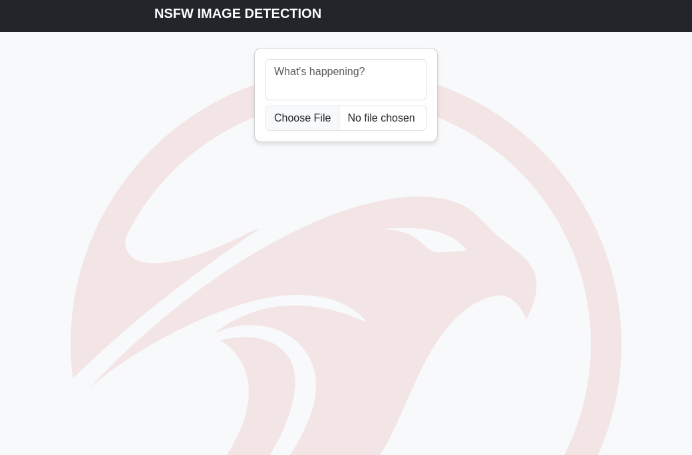
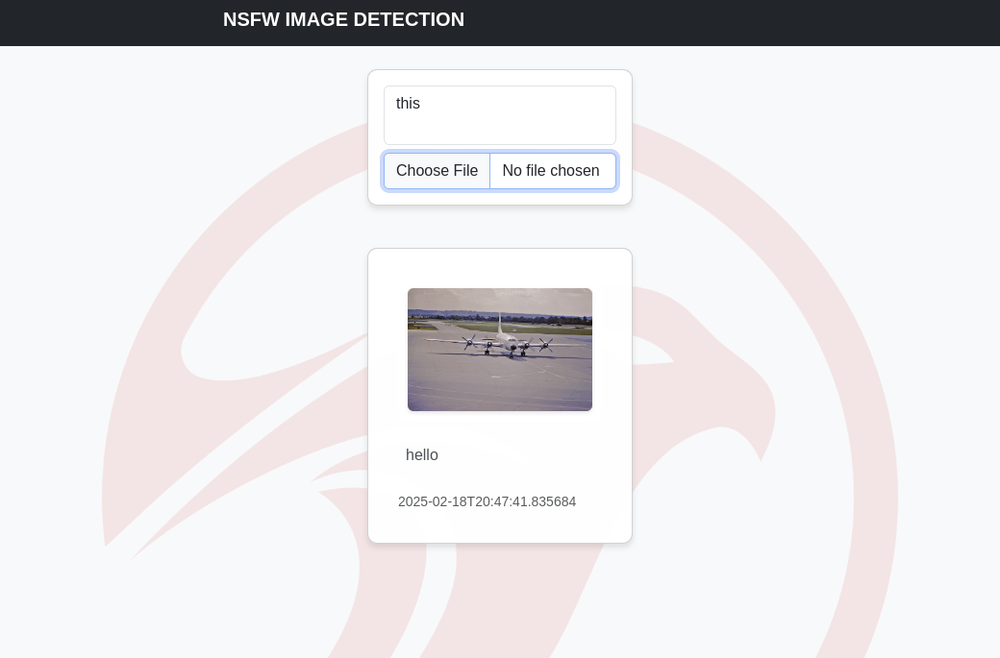

# Basic NSFW Image Detection by FALCONS.AI

Copyright © 2025 FALCONS.AI. All rights reserved.
<!-- PROJECT LOGO -->
<br />
<div align="center" style='background-color:#ffffff'>
    
</div>


## Overview
This repo is designed as a fast start to any developer to build a personal NSFW content detection solution. The Flask-based web application demonstrates real-time NSFW (Not Safe For Work) image detection using FALCONS.AI's open-source #1 NSFW classification model, available on HuggingFace, leading the community with a staggering <span style="font-size: 1.5em;">80 MILLION downloads!</span> The application provides automatic content moderation with visual feedback, leveraging state-of-the-art machine learning for accurate and efficient image classification. Once the 1st run has completed, this can be used completely offline to alleviate any data privacy concerns. All functionality and data storage remains local to the system its being run on and nothing is sent out anywhere.


## Simple UI

|  |  |
|:--------------------------------:|:-------------------------------:|


*Each interface component is designed for simplicity and ease of use while maintaining robust functionality.*


## Key Features

- **Advanced NSFW Detection**: Powered by FALCONS.AI's #1 open-source NSFW classification model on HuggingFace
- **Real-time Processing**: Instant content moderation during upload
- **Visual Feedback**: Clear identification of flagged content with red borders
- **Content Management**: Automatic file renaming and organization of flagged content
- **Metadata Tracking**: CSV-based storage of image information and moderation results

## Model Information

The application utilizes FALCONS.AI's #! NSFW classification model, which offers:
- State-of-the-art accuracy in NSFW content detection
- Fast inference times suitable for real-time applications
- Open-source availability on HuggingFace
- Regular updates and community contributions

## Technical Stack

- **AI Model**: FALCONS.AI #! NSFW classifier (HuggingFace)
- **Backend**: Python Flask
- **Frontend**: HTML5, CSS3, Bootstrap 5
- **Storage**: File system + CSV metadata
- **Processing**: Real-time image classification

## Directory Structure

```
/
├── app.py              # Main application file
├── captions.csv        # Image metadata storage
├── detect_nsfw.py      # NSFW detection module
├── media/             # Image storage directory
├── static/
│   └── css/
        └── style.css   # Custom styles
        └── bootstrap.min.css   # Bootstrap styles
    └── js/
        └── bootstrap.bundle.min.js   # Bootstrap javascript
└── templates/
    └── index.html      # Main template
```

## Installation

1. Clone the repository:
```bash
git clone https://github.com/Falcons-ai/basic_nsfw_detection_solution
cd basic_nsfw_detection
```

2. Install required dependencies:
```bash
pip install -r requirements.txt
```

3. Create required directories:
```bash
mkdir -p media
mkdir -p static/css
```

4. Launch the application:
```bash
python app.py
```

## NSFW Detection Process

1. **Upload Processing**
   - Images are temporarily stored for processing
   - The #! model analyzes the content
   - Results determine file handling and display

2. **Classification Results**
   - Images classified as NSFW are prefixed with "nsfw_"
   - Visual indicators are added to the interface
   - Metadata is updated in the CSV file

3. **Content Management**
   - Automatic organization of flagged content
   - Clear visual separation in the interface
   - Persistent tracking of moderation results

## Configuration

Key configuration options in `app.py`:

- `UPLOAD_FOLDER`: Image storage location
- `ALLOWED_EXTENSIONS`: Supported file types
- `NSFW_PREFIX`: Prefix for flagged content
- `CAPTIONS_FILE`: Metadata storage location
- `MAX_CONTENT_LENGTH`: Upload size limit

## Security Features

1. **Content Safety**
   - Real-time NSFW detection
   - Automatic content flagging
   - Clear visual warnings

2. **File Security**
   - Type validation
   - Size restrictions
   - Secure naming

3. **Error Handling**
   - Upload validation
   - Processing verification
   - Failure recovery

## Usage

1. **Image Upload**
   - Select or drag-drop images
   - Add optional captions
   - Automatic processing on upload

2. **Content Review**
   - Chronological display
   - NSFW content clearly marked
   - Caption display

3. **Metadata Management**
   - Automatic CSV updates
   - Classification results stored
   - Timestamp tracking

## CSV Structure

The `captions.csv` file format:
```csv
filename,caption,timestamp
image1.jpg,"Sample caption",2025-02-18T14:30:00
nsfw_image2.png,"Another caption",2025-02-18T14:35:00
```

## Error Handling

- `400`: Invalid file or selection
- `413`: Size limit exceeded
- `500`: Processing error

## Performance

- Asynchronous processing
- Efficient metadata handling
- Optimized file operations
- Responsive interface

## Development Guidelines

1. **Code Standards**
   - PEP 8 compliance
   - Semantic HTML5
   - Consistent CSS

2. **Testing**
   - Classification accuracy
   - File handling
   - Interface responsiveness

3. **Security**
   - Content validation
   - Input sanitization
   - Error management

## Browser Support

- Chrome 80+
- Firefox 75+
- Safari 13+
- Edge 80+

## Support

For technical assistance or inquiries:
- Visit: https://falcons.ai/ for more information.
- Model Repository: https://huggingface.co/Falconsai/nsfw_image_detection

## License

Copyright © 2025 FALCONS.AI. All rights reserved.
The application code is proprietary and confidential.
The #1 NSFW classification model is open-source and available on HuggingFace.
